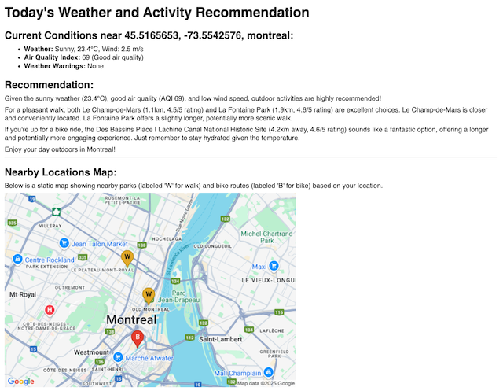

## Weather Agent for Daily Activity Recommendations
An agent to provide daily activity recommendations (walks, indoor options) based on a user-defined location's weather, air quality, and weather event warnings. Built with Python in Google Colab for a portfolio project, it processes geocoding, weather, air quality, and park data to deliver email summaries.

## Features
- Geocoding: Converts user address to coordinates using Geopy.

- Current Weather: Fetches weather data (e.g., Mist, 24.3°C, Wind: 4.2 m/s) via Environment Canada API.

- Air Quality: Obtains air quality index (e.g., AQI=46, Moderate) using Google Air Quality API.

- Weather Warnings: Retrieves weather event warnings from Environment Canada.

- Nearby Parks and Bike Routes: Identifies parks for short walk and bike routes with Google Places API.

- Recommendation Summary: Generates concise activity recommendations (e.g., short walks, no biking for moderate AQI) using Gemini API.

- Email Delivery: Sends formatted recommendations via email with map rendered.

## Output Example
Current Conditions near 45.5165653, -73.5542576, montreal:
Weather: Sunny, 28.4°C, Wind: 2.5 m/s
Air Quality Index: 54 (Moderate air quality)
Weather Warnings: None

Recommendation:
Given the sunny weather and moderate air quality (AQI 54), outdoor activities are a reasonable option today, but with some caveats. The heat and moderate air quality mean you should prioritize shorter, less intense activities.

For a pleasant walk, I'd recommend Le Champ-de-Mars (1.1 km away, 4.5/5 rating) due to its closer proximity. While La Fontaine Park has a slightly higher rating, the extra distance might make it too strenuous in the heat.

If you're up for a longer bike ride, the Des Bassins Place | Lachine Canal National Historic Site route (4.2 km away, 4.6/5 rating) sounds appealing, but be mindful of the heat and air quality and take breaks as needed. Stay hydrated!

Remember to heed the air quality advisory: If you experience any respiratory discomfort, reduce your activity level and head indoors. Consider limiting your time near busy streets.

## Screenshot

## Setup

1. Clone the repository: git clone https://github.com/pegasuschild/weather-agent.git.

2. Open weather_agent.ipynb in Google Colab.

3. Set API keys in Colab Secrets:
   - GOOGLE_API_KEY for Geocoding, Air Quality, and Places APIs.
   - EMAIL_PASSWORD for Gmail (App Password).
   - Run the notebook to generate and email recommendations.

## Technologies
- Python 3.9 (Google Colab)
- Google Maps Geocoding API
- Environment Canada (weather and warnings)
- Google Air Quality API
- Google Places API
- Gemini API (LLM)
- smtplib (for email)

## Development
The Colab notebook (`Weather_Agent.ipynb`) contains the development process, including code cells for creating and testing the chatbot in Google Colab.

## About
Built by Daniel Young as a portfolio project to showcase Python and Streamlit skills in rapid prototyping for data science education.

## License
MIT License - feel free to use and modify the code!
